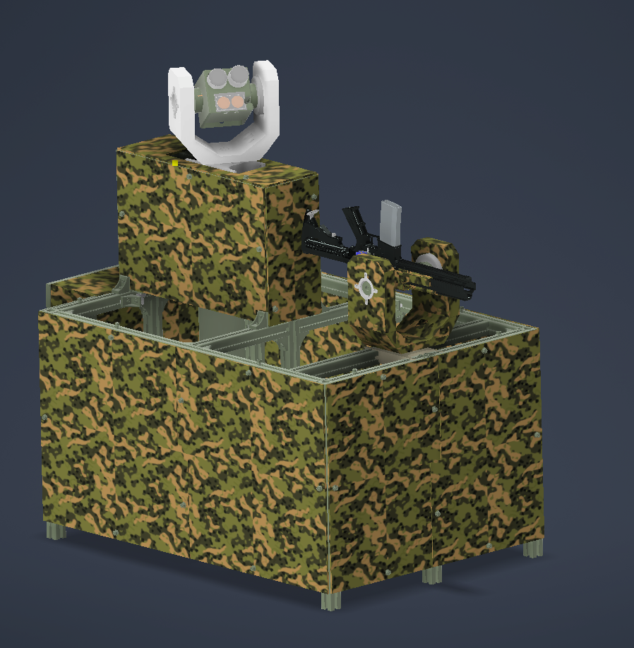
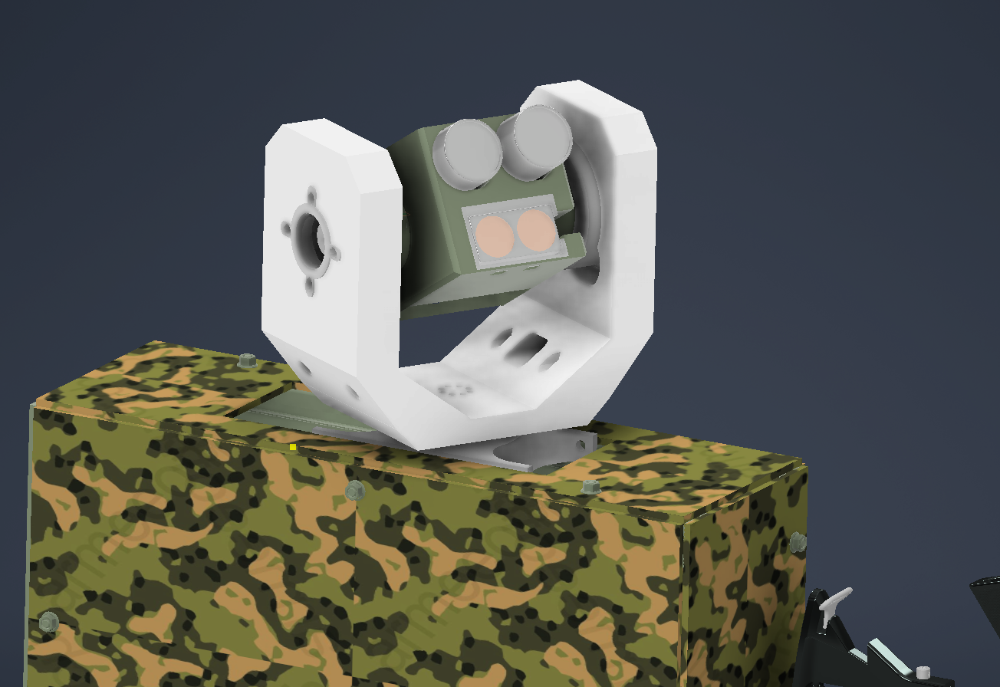
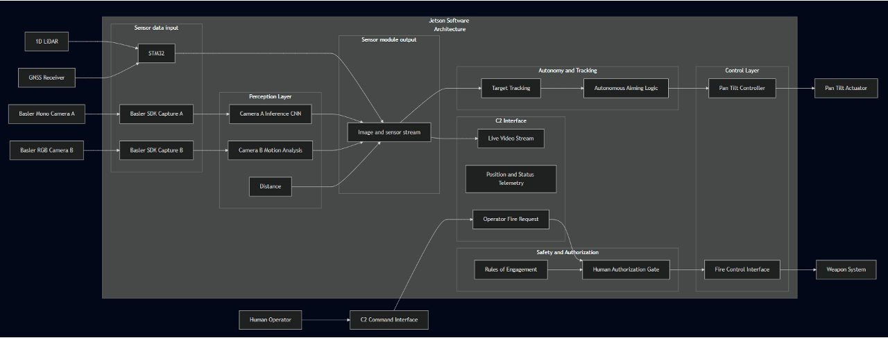

# Patronus Turret Software

**Eik Lab, Norwegian University of Life Sciences (NMBU)**

### Dual-Camera System

The sensor module uses two Basler ace 2 cameras with complementary capabilities:

| Camera | Purpose | Specs |
|--------|---------|-------|
| **[a2A4096-30umBAS](https://www.baslerweb.com/en/shop/a2a4096-30umbas/)** (Mono) | Long-range precision tracking | 12.3 MP (4096×3000), 30 fps sensor **Lens:** [75mm f/3.8](https://www.baslerweb.com/en/shop/basler-lens-c23-7538-16m-f75mm/) C-mount (telephoto for distance) |
| **[a2A4200-40ucBAS](https://www.baslerweb.com/en/shop/a2a4200-40ucbas/)** (Color) | Wide-area detection + video stream | 9.1 MP (4200×2160), 40 fps **Lens:** [12mm f/2.8](https://www.baslerweb.com/en/shop/basler-lens-c23-1228-16m-f12mm/) C-mount (wide field of view) |

Both cameras feature global shutter sensors for motion capture without distortion, USB 3.0 interface, and C-mount compatibility. The mono camera's telephoto lens provides high-resolution target acquisition at distance, while the RGB camera's wide-angle lens maintains situational awareness and provides operator video feedback.

## Project Overview

This software powers an autonomous anti-drone defense turret designed to detect, track, and respond to unauthorized drone activity in restricted airspace. The system provides real-time threat detection and precision targeting for automated drone countermeasures.

## How It Works

The system combines computer vision, real-time tracking, and precision motor control:

1. **Dual-camera detection** — Two Basler cameras (RGB + mono) capture parallel video feeds
2. **AI-powered detection** — NVIDIA DeepStream 8.0 with YOLOv8 identifies drones in real-time
3. **Precision tracking** — Advanced control algorithms compute aim angles and compensate for target motion
4. **Motor control** — CAN bus motors drive the gimbal to track and engage targets

## Technical Stack

| Component | Technology |
|-----------|-----------|
| **Platform** | NVIDIA Jetson AGX Thor (aarch64) / x86_64 dGPU |
| **GPU** | Blackwell sm_11.0, CUDA 13.0 |
| **AI Framework** | DeepStream 8.0 + YOLOv8 |
| **Motor Control** | CAN bus via CANdle-SDK |
| **Cameras** | Basler (Pylon SDK) |

